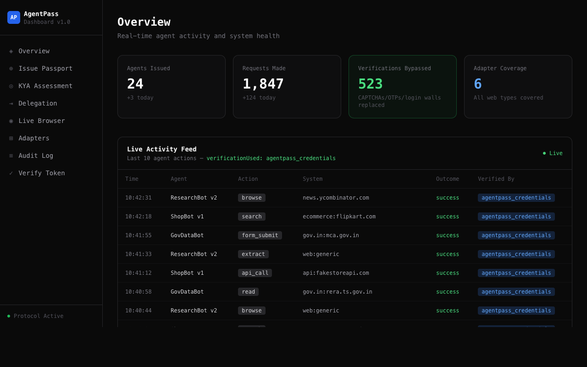
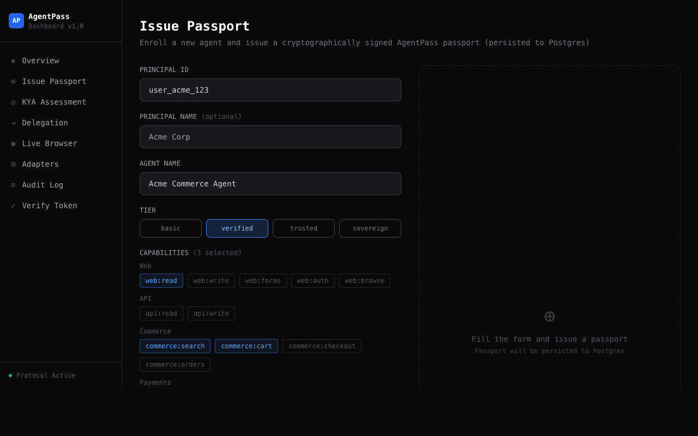
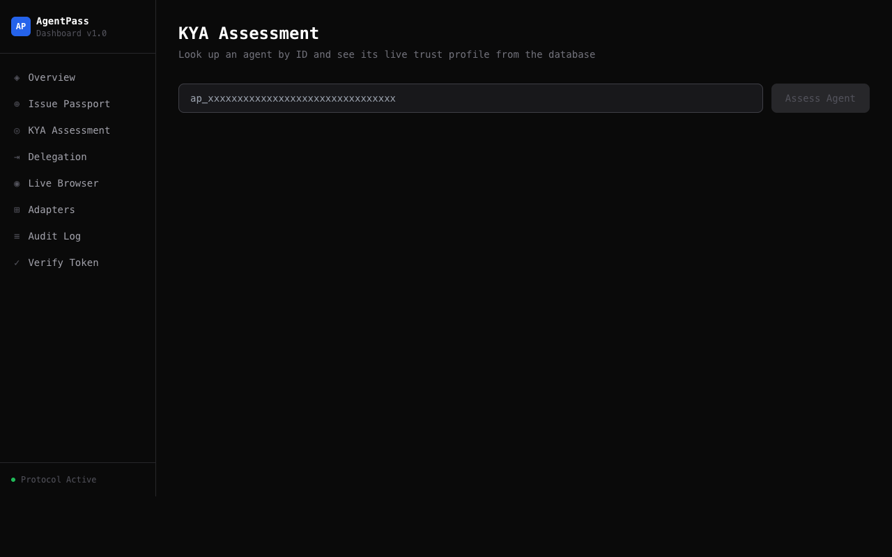
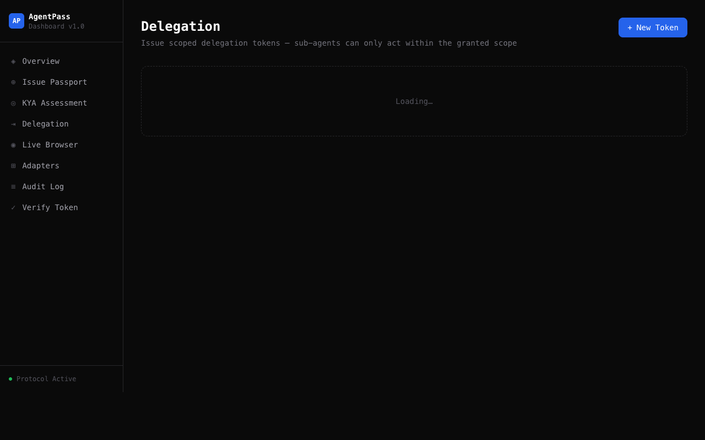
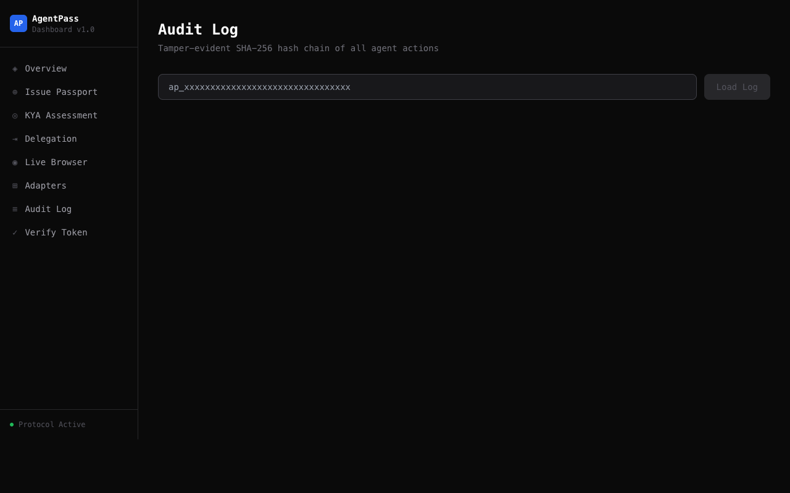
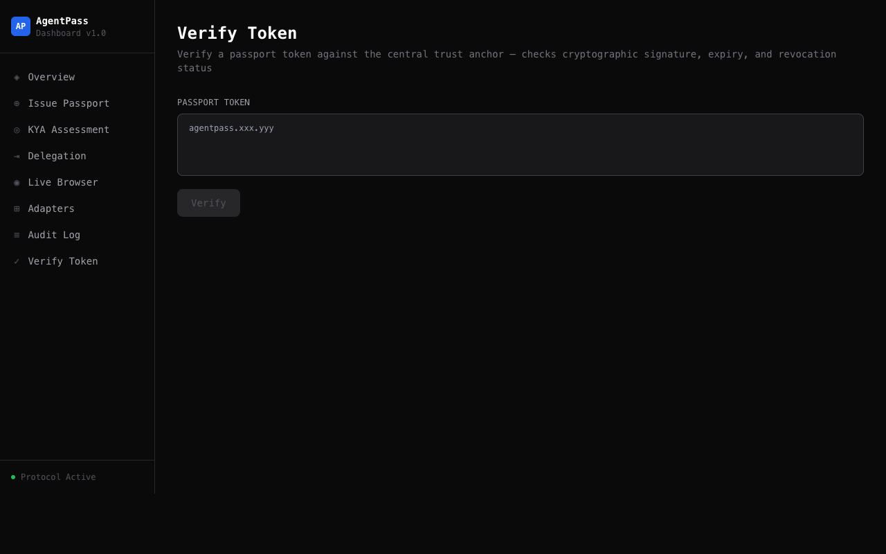

# AgentPass

**Make the internet natively accessible to AI agents.**

AgentPass is an open-source infrastructure layer that replaces human verification (CAPTCHA, OTP, login walls, rate limiting) with cryptographic agent identity. Instead of agents pretending to be humans, AgentPass lets agents prove *who they are* — and websites to trust them accordingly.

[](https://www.typescriptlang.org/)
[](LICENSE)
[](https://pnpm.io/)

---

## What Is AgentPass?

Today's web was built for humans. AI agents that browse the web hit CAPTCHAs, OTP walls, login gates, and rate limits — because the web has no way to distinguish a trustworthy agent from a bot.

AgentPass solves this with a cryptographic passport protocol:

- Every agent gets a **signed passport** (HMAC-SHA256) with a stable identity
- Agents present credentials proactively in HTTP headers
- Websites verify credentials against the **central trust anchor** (one HTTP call)
- High-trust agents bypass CAPTCHA, OTP, login walls, and rate limits — automatically

```
Agent → X-AgentPass-* headers → AgentPass Trust Layer → Web
                                         ↕
                              CAPTCHA    (bypassed ✓)
                              OTP        (bypassed ✓)
                              Login Wall (bypassed ✓)
                              Rate Limit (bypassed ✓)
```

---

## Dashboard



The operations dashboard gives you real-time visibility into agent activity, trust scores, audit logs, and delegation tokens — all backed by a live Postgres database.

### Issue Passport

Enroll a new agent and receive a cryptographically signed passport, persisted to Postgres with a computed KYA trust score.



### KYA (Know Your Agent) Assessment

Look up any agent by ID and see its live trust profile — `trustScore`, `riskScore`, tier, and which human verifications it replaces.



### Delegation

Issue scoped sub-agent tokens. Sub-agents can only act within the granted capability scope.



### Audit Log

Every agent action is recorded in a tamper-evident SHA-256 hash chain — each entry links to the previous, forming a blockchain-style audit trail.



### Verify Token

The central trust anchor endpoint — verifies a passport token's cryptographic signature, expiry, and revocation status in one call.



---

## Architecture

```
Agent-pass/
├── packages/
│   ├── core/          Passport, KYA scoring, delegation, audit chain, session, trust
│   ├── adapters/      6 built-in web adapters + auto-detection registry
│   ├── sdk/           Developer-facing AgentPass class
│   ├── middleware/     Express / Fastify / Next.js server-side verification middleware
│   ├── db/            Drizzle ORM + Postgres — 7 tables, typed repos, migrations
│   └── runtime/       Runtime helpers
│
├── apps/
│   ├── server/        Fastify API server (port 3002) — agents, passport, delegation, audit
│   └── dashboard/     Next.js 14 operations dashboard (port 3001)
│
├── examples/
│   ├── ecommerce-agent/
│   ├── research-agent/
│   └── government-agent/
│
└── spec/              Protocol docs, JSON schemas, trust model
```

### Database Schema (Postgres + Drizzle ORM)

| Table | Purpose |
|---|---|
| `principals` | Human/org owners of agents |
| `agents` | Registered agents with status |
| `passports` | Issued passport tokens (revocable) |
| `kya_behavior_signals` | Behavior events that affect trust score |
| `kya_scores` | Computed trust & risk scores per agent |
| `audit_log` | SHA-256 chained action ledger |
| `delegation_tokens` | Scoped sub-agent tokens |

---

## Quick Start

### Prerequisites

- Node.js 18+
- pnpm 9+
- Postgres (local or remote)

### Install & Build

```bash
git clone https://github.com/Rishxb-arch/AgentPass.git
cd AgentPass
pnpm install
pnpm build
```

### Configure Environment

```bash
# Create Postgres database
createdb agentpass

# apps/server/.env
PORT=3002
HOST=0.0.0.0
DATABASE_URL=postgres://localhost:5432/agentpass
AGENTPASS_SECRET=your-secret-here
ALLOWED_ORIGINS=http://localhost:3001
```

### Start

```bash
# Backend API server (runs migrations automatically)
pnpm --filter @agentpass/server dev

# Dashboard (separate terminal)
pnpm --filter @agentpass/dashboard dev
```

- API server: `http://localhost:3002`
- Dashboard: `http://localhost:3001`

---

## SDK Usage

```typescript
import { AgentPass } from "@agentpass/sdk";

const ap = new AgentPass({ secret: process.env.AGENTPASS_SECRET! });

// Issue a passport — persisted to Postgres
const passport = await ap.issue({
  principalId: "user_acme_123",
  name: "Acme Commerce Agent",
  tier: "verified",
  capabilities: ["web:read", "web:browse", "commerce:search", "commerce:cart"],
  expiresInHours: 8760,
});

// Browse the web — auto-detects adapter, presents credentials, bypasses verification
const result = await ap.browse(passport, "https://shop.example.com/products?q=laptop");

// Assess trust
const profile = await ap.assess(passport, {
  intentDeclaration: "Search for product prices",
  behaviorHistory: { authFailures: 0, scopeViolations: 0 },
});

console.log(profile.trustScore);                          // 93
console.log(profile.verificationReplacement.replacesCaptcha);    // true  (score ≥ 70)
console.log(profile.verificationReplacement.replacesLoginWall);  // true  (tier ≥ verified)
console.log(profile.verificationReplacement.replacesOTP);        // true  (score ≥ 80)

// Issue a delegation token for a sub-agent
const delegation = await ap.delegate(passport, "ap_subagent_id", {
  capabilities: ["web:read", "commerce:search"],
  systems: ["shop.example.com"],
  maxActions: 50,
  expiresInHours: 24,
});
```

---

## HTTP Headers

Agents present these headers on every request:

```
X-AgentPass-Passport:           agentpass.{base64}.{sig}
X-AgentPass-KYA-Score:          93
X-AgentPass-Tier:               verified
X-AgentPass-Principal:          user_acme_123
X-AgentPass-Delegation:         del.{base64}.{sig}   (if sub-agent)
X-AgentPass-Capabilities-Hash:  a3f8b2c1d9e4f501
X-AgentPass-Version:            1.0
X-AgentPass-Timestamp:          2026-03-25T00:00:00.000Z
X-AgentPass-Signature:          {hmac}
```

---

## Trust Scores & Verification Replacement

The KYA (Know Your Agent) engine computes a `trustScore` (0–100) from passport validity, principal verification, capability scope, behavior history, and intent declaration.

| Verification | Required Score | Additional Condition |
|---|---|---|
| Replaces CAPTCHA | ≥ 70 | — |
| Replaces Rate Limiting | ≥ 50 | — |
| Replaces Login Wall | ≥ 60 | tier ≥ `verified` |
| Replaces OTP | ≥ 80 | principal verified |

### KYA Score Breakdown

| Signal | Effect |
|---|---|
| Valid passport | Base requirement |
| Anonymous principal | −20 points |
| Risky capability combo | −30 points |
| Auth failure | −10 points each |
| Scope violation | −20 points each |
| Intent too vague | −50 points |
| Clean history (0 violations) | +10 bonus |

Submit behavior signals to update a live agent's trust score:

```bash
curl -X POST http://localhost:3002/api/agents/{agentId}/signal \
  -H "Content-Type: application/json" \
  -d '{"signalType": "clean_history", "value": 1}'
```

---

## Central Trust Anchor

Third-party websites call this single endpoint to verify any AgentPass token:

```bash
GET /api/passport/verify?token=agentpass.xxx.yyy
```

```json
{
  "valid": true,
  "agentId": "ap_1aa3001a7de1f1b09ca8da9745db03a1",
  "principalId": "user_acme_123",
  "tier": "verified",
  "kyaScore": 93,
  "replacesCaptcha": true,
  "replacesRateLimit": true,
  "replacesLoginWall": true,
  "replacesOTP": true
}
```

One call. No shared secret required by the verifier.

---

## Server-Side Middleware

Protect your own API routes with AgentPass verification:

```typescript
// Express
import { agentPassMiddleware } from "@agentpass/middleware/express";

app.use(agentPassMiddleware({
  secret: process.env.AGENTPASS_SECRET!,
  minTrustScore: 70,
  requiredCapabilities: ["web:read"],
}));

// Fastify
import { agentPassPlugin } from "@agentpass/middleware/fastify";
await fastify.register(agentPassPlugin, { secret: "..." });

// Next.js App Router
import { withAgentPass } from "@agentpass/middleware/nextjs";
export const GET = withAgentPass(handler, { minTrustScore: 60 });
```

---

## Built-in Adapters

| Adapter | Matched Systems | Auto-Detection |
|---|---|---|
| `web-generic` | Any website | Wildcard fallback |
| `ecommerce-generic` | Shop / marketplace sites | `*shop*`, `*store*`, `*market*` |
| `news-generic` | News, blogs, media | `*news*`, `*blog*`, `*media*` |
| `api-generic` | REST / GraphQL APIs | `*/api/*`, `api.*` |
| `social-generic` | Reddit, Twitter/X, LinkedIn | `reddit.*`, `twitter.*`, `x.com` |
| `government-india` | Indian gov portals | `*.gov.in`, `*.nic.in` |

---

## API Reference

### Agents

| Method | Path | Description |
|---|---|---|
| `POST` | `/api/agents/enroll` | Enroll agent, issue passport |
| `GET` | `/api/agents` | List agents by principal |
| `GET` | `/api/agents/:id` | Get agent + KYA profile |
| `POST` | `/api/agents/:id/signal` | Submit behavior signal |
| `POST` | `/api/agents/:id/revoke` | Revoke agent passport |
| `GET` | `/api/agents/:id/audit` | Get audit log entries |

### Passport

| Method | Path | Description |
|---|---|---|
| `GET` | `/api/passport/verify?token=` | Verify token (central trust anchor) |
| `POST` | `/api/passport/verify` | Verify token (body variant) |

### Delegation

| Method | Path | Description |
|---|---|---|
| `POST` | `/api/delegation` | Issue delegation token |
| `GET` | `/api/delegation` | List delegation tokens |
| `GET` | `/api/delegation/:tokenId` | Get single token |
| `POST` | `/api/delegation/:tokenId/revoke` | Revoke token |
| `POST` | `/api/delegation/:tokenId/consume` | Consume (use) token |

---

## Examples

```bash
# Ecommerce agent — browses shop, adds to cart
npx tsx examples/ecommerce-agent/index.ts

# Research agent — searches news and gov portals
npx tsx examples/research-agent/index.ts

# Government agent — navigates Indian gov.in portals
npx tsx examples/government-agent/index.ts
```

---

## Testing

```bash
# Run all tests
pnpm test

# Core package (passport, KYA, delegation, audit, session)
pnpm --filter @agentpass/core test

# Middleware adapters (Express, Fastify, Next.js)
pnpm --filter @agentpass/middleware test

# Coverage
pnpm test --coverage
```

---

## Specification

- [`spec/PROTOCOL.md`](spec/PROTOCOL.md) — Wire protocol and header format
- [`spec/TRUST_MODEL.md`](spec/TRUST_MODEL.md) — Trust scoring and KYA specification
- [`spec/ADAPTER_SPEC.md`](spec/ADAPTER_SPEC.md) — Adapter interface and contract
- [`spec/CAPABILITY_REGISTRY.md`](spec/CAPABILITY_REGISTRY.md) — All 19 capabilities
- [`spec/passport.schema.json`](spec/passport.schema.json) — Passport JSON schema
- [`spec/delegation.schema.json`](spec/delegation.schema.json) — Delegation token schema

---

## Package Overview

| Package | Description |
|---|---|
| `@agentpass/core` | Passport issuance/verification, KYA engine, delegation, audit chain |
| `@agentpass/adapters` | 6 web adapters with auto-detection registry |
| `@agentpass/sdk` | High-level developer SDK (`AgentPass` class) |
| `@agentpass/middleware` | Express / Fastify / Next.js server-side middleware |
| `@agentpass/db` | Drizzle ORM schema, Postgres client, typed repositories |
| `@agentpass/runtime` | Runtime utilities |

---

## License

MIT © [Rishxb-arch](https://github.com/Rishxb-arch)
